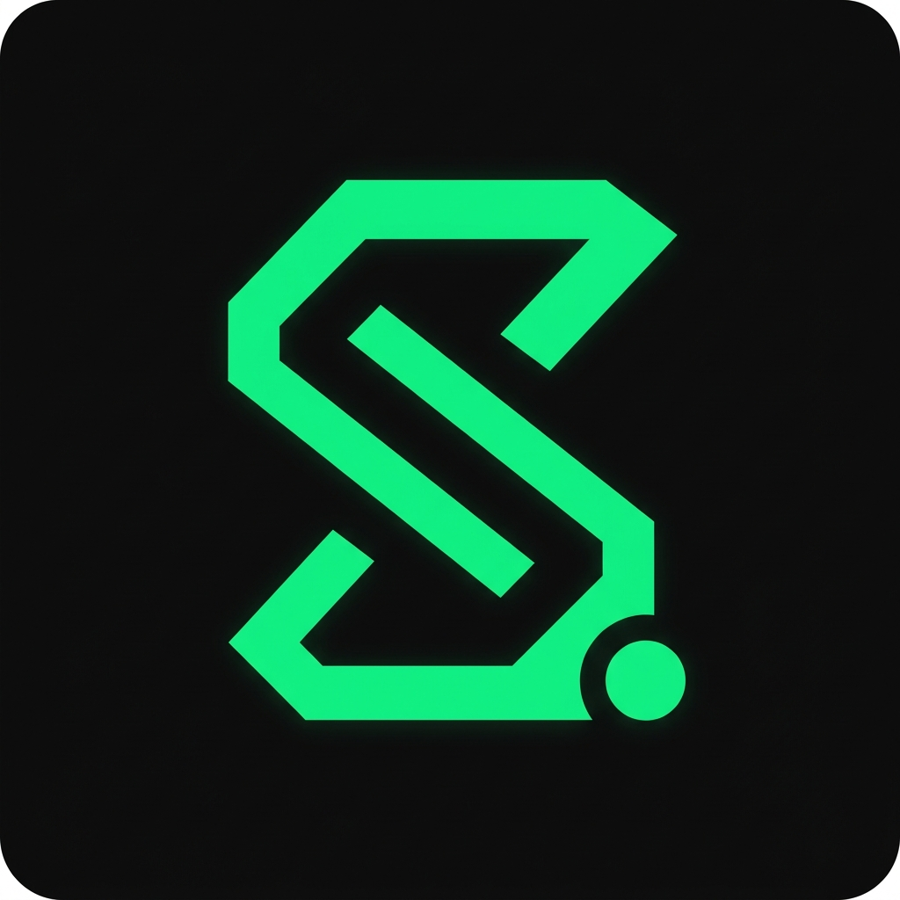

# SCommit (Team 3)

<div align="center">
   <a href="https://www.scommit.store/">
    
  </a>
  <br>
  <h3>창작자와 팬을 연결하는 특별한 멤버십 플랫폼, SCommit</h3>
</div>

<p align="center">
  
  
  
  
  
</p>

## 📝 프로젝트 소개

**SCommit**은 창작자의 콘텐츠를 구독하고 후원할 수 있는 크리에이터 멤버십 플랫폼입니다.
창작자는 자신의 창작물을 가치 있게 공유할 수 있고, 팬들은 자신이 사랑하는 창작자를 직접적으로 후원하며 '독점 콘텐츠'를 즐길 수 있는 건강한 후원 생태계를 지향합니다.

---

## Team Githubs

🍊 남효림 | [@EuniceNam](https://github.com/EuniceNam)

🤖 오준서 | [@piker0925](https://github.com/piker0925)

🍵 한철완 | [@Mungwani](https://github.com/Mungwani)

🐧 최선진 | [@Ant1Ch3aT](https://github.com/Ant1Ch3aT)

---

## 핵심 서비스 기능 (Key Features)

### 1. 창작자 구독 및 등급별 멤버십 시스템

- **일반 팔로우 (Follow)**: 관심 있는 창작자를 팔로우하여 전체 공개된 소식을 피드에서 모아볼 수 있습니다.
- **유료 멤버십 (Membership)**: 창작자를 후원하고, 오직 멤버십 회원만을 위해 잠겨있는 **독점(프라이빗) 콘텐츠** 열람 권한을 획득합니다.
- **통합 마이페이지**: 내가 구독 중인 창작자들의 총 팔로워 수와 나의 결제/구독 통계 등을 지연 없이 빠르게 렌더링합니다. (N+1 쿼리 최적화 완료)

### 2. 권한 기반 포스트(게시글) 시스템

- **세밀한 공개 범위 설정**: 창작자가 글을 쓸 때 전체 공개, 팔로워 전용, 멤버십 전용 등으로 콘텐츠 열람 권한을 자유롭게 설정할 수 있습니다.
- **리치 텍스트 & 미디어**: 썸네일 이미지와 텍스트가 결합된 풍부한 게시글 작성을 지원합니다. (Cloudinary 연동)
- **인터랙션(소통)**: 마음에 드는 게시글에 좋아요(Like)를 누르거나, 북마크(Bookmark) 기능을 통해 나만의 보관함에 저장해 두고 나중에 다시 꺼내 볼 수 있습니다.

### 3. 맞춤형 피드 (Feed)

- 수많은 게시글 중, **내가 팔로우하거나 멤버십을 결제한 창작자들의 최신 글**만 필터링하여 나만의 맞춤형 피드 화면을 제공합니다.
- 무한 스크롤 및 페이지네이션을 통해 수많은 콘텐츠도 끊김 없이 부드럽게 탐색할 수 있습니다.

### 4. JWT 기반의 강력한 보안 및 인증

- 비밀번호 단방향 암호화 및 JWT(JSON Web Token)를 활용하여 안전하고 빠른 로그인을 지원합니다.
- 철저한 권한 검증(Spring Security): 사용자가 특정 게시글을 클릭할 때마다 "이 유저가 멤버십을 결제했는가?"를 서버에서 실시간으로 검증하여 비인가자의 불법 열람을 100% 차단합니다.

---

## 🛠 기술 스택

### Backend

- Java 17, Spring Boot 3.x
- Spring Data JPA, QueryDSL
- Spring Security, JWT (JJWT)

### Database & Infra

- MySQL 8.0
- Docker, Docker Compose

### Testing & Monitoring

- JUnit5, Mockito
- K6 (Performance & Stress Testing)

## Getting Started

1. **Clone the repository**
   ```bash
   git clone https://github.com/prgrms-be-devcourse/NBE10-12-2-Team3.git
   cd NBE10-12-2-Team3
   ```
2. **Run with Docker Compose** (DB 등 인프라)
   ```bash
   docker-compose up -d
   ```
3. **Run Spring Boot**
   ```bash
   cd back
   ./gradlew bootRun
   ```
